# UI & Responsiveness Comprehensive Audit Report

**Date:** 2026-08-26  
**Auditor:** UI Audit Agent (`agent-browser` Chromium inspection)  
**Status:** Complete Audit & Remediation Guide  
**Target Codebase:** `arthow4n/did-it-become-what-you-like`  
**Design Contract:** [`DESIGN_SYSTEM.md`](../DESIGN_SYSTEM.md), [`UI_SPEC.md`](../UI_SPEC.md)

---

## 1. Executive Summary

This audit provides an exhaustive, screenshot-backed evaluation of the **After Midnight** user interface across mobile (`390×844`) and desktop (`1280×800`) viewports, as well as the design system component gallery (`src/design-system/gallery.html`).

While the underlying functional domain, XState actor topology, local IndexedDB persistence, Automerge CRDT sync, and Gemini receipt parsing are complete (MVP done), the visual presentation and CSS layout implementation contain critical styling defects, responsive inversions, alignment bugs, and CSS grid/flex regressions that severely impair usability.

### Core Issue Categories
1. **Inverted Mobile Navigation:** Navigation tabs are rendered at the top header on compact viewports instead of anchoring to the bottom with safe-area insets as specified in `DESIGN_SYSTEM.md`.
2. **Clear Button Overflow Bug:** `SearchField` clear (`X`) buttons are rendered as dark squares floating over the top border of inputs due to relative positioning on the entire field grid container rather than the control wrapper.
3. **Notification Toast Layout Shifts (CLS):** Toasts and their dismiss buttons are rendered directly inside normal document flow, bumping the entire page layout whenever a message appears, with the dismiss button detached from the floating notification.
4. **Required Asterisk Line Break:** In `TextField` and other inputs, the required `*` indicator is rendered as a standalone grid child, placing it on its own separate line between the label and input.
5. **CSS Grid Unbounded Stretching:** Grid rows in `ResponsiveGrid` default to `align-items: stretch` without `align-content: start`, stretching `SegmentedControl` into giant 220px ovals/circles and distorting `ActionCard`s.
6. **Catastrophic Text/Money Wrapping:** `.ds-money` has `overflow-wrap: anywhere; white-space: normal;`, causing currency amounts (e.g. `SEK -286.40`) in list rows to wrap character-by-character into vertical columns.
7. **FilterBar Alignment & Clipping:** Missing labels on filter triggers cause jagged vertical alignment against labeled inputs, and segmented controls clip text on narrow screens.
8. **Premature Unsaved Changes Warning:** Pristine (untouched) forms display a prominent "Unsaved changes" banner immediately upon opening.
9. **Smashed PageHeader Back Triggers:** Back and Close links render as unstyled plain text smashed against `<h1>` headings without icon or visual hierarchy.
10. **SecretField Layout:** Password "Show value" toggle is rendered as an isolated centered button below the input rather than an inline trailing adorner.

---

## 2. Screenshot Inventory Index

All visual evidence referenced in this audit is located in the `screenshots/` directory alongside this document:

| Ref | Screenshot File | Viewport | Screen / Workflow | Key Issue Illustrated |
|---|---|---|---|---|
| **S01** | `screenshots/01_desktop_home_initial.png` | 1280×800 | First-Use Empty State | Desktop layout & banner alignment |
| **S02** | `screenshots/02_mobile_home_initial.png` | 390×844 | Mobile First-Use | **Top navigation bug** on mobile |
| **S03** | `screenshots/03_desktop_create_project_modal.png` | 1280×800 | Create Project Modal | Asterisk on separate line; unstyled Back text |
| **S04** | `screenshots/04_desktop_input_clear_button_bug.png` | 1280×800 | Create Project Input | Text input focus & field styling |
| **S05** | `screenshots/05_desktop_project_created_toast.png` | 1280×800 | Expenses (Project Created) | Filter row misalignment; clear button overflow |
| **S06** | `screenshots/06_desktop_add_choice_modal.png` | 1280×800 | Add Choice Dialog | ActionCard dialog layout |
| **S07** | `screenshots/07_desktop_manual_expense_form.png` | 1280×800 | Manual Expense Form (Top) | Premature dirty warning; SegmentedControl void |
| **S08** | `screenshots/08_desktop_manual_expense_form_bottom.png` | 1280×800 | Manual Expense Form (Mid) | Clear button on empty Merchant input |
| **S09** | `screenshots/09_desktop_manual_expense_form_actions.png` | 1280×800 | Manual Expense Form (Actions) | Save buttons right-alignment |
| **S10** | `screenshots/10_mobile_manual_expense_form_top.png` | 390×844 | Mobile Expense Form (Top) | Mobile form layout & top navigation |
| **S11** | `screenshots/11_mobile_manual_expense_form_bottom.png` | 390×844 | Mobile Expense Form (Mid) | Mobile field spacing |
| **S12** | `screenshots/12_mobile_manual_expense_form_save_buttons.png` | 390×844 | Mobile Expense Form (Bottom) | Non-sticky action buttons on mobile |
| **S13** | `screenshots/13_desktop_expense_form_filled.png` | 1280×800 | Filled Expense Form | Floating `X` clear button on Merchant field |
| **S14** | `screenshots/14_desktop_toast_layout_bump_bug.png` | 1280×800 | Expense Saved State | **Toast document flow bump** & detached dismiss |
| **S15** | `screenshots/15_desktop_expenses_list_with_item.png` | 1280×800 | Expenses List View | Decimal precision (`.5`), filter row misalignment |
| **S16** | `screenshots/16_mobile_expenses_list_with_item.png` | 390×844 | Mobile Expenses List | Massive header clutter before expense list |
| **S17** | `screenshots/17_desktop_filters_modal.png` | 1280×800 | Advanced Filters Modal | Full-width segmented sort; stray dismiss button |
| **S18** | `screenshots/18_desktop_organize_view.png` | 1280×800 | Organize Hub | Organize cards & section layout |
| **S19** | `screenshots/19_desktop_manage_projects.png` | 1280×800 | Manage Projects Screen | Floating "Edit" button & unstyled Back text |
| **S20** | `screenshots/20_desktop_manage_categories.png` | 1280×800 | Manage Categories Screen | SearchField clear button overflow |
| **S21** | `screenshots/21_desktop_create_category_form.png` | 1280×800 | Create Category Form | Asterisk line break; custom color alignment |
| **S22** | `screenshots/22_desktop_settings_main.png` | 1280×800 | Settings Main Screen | Settings card list layout |
| **S23** | `screenshots/23_desktop_settings_drive_sync.png` | 1280×800 | Google Drive Sync Settings | Back button formatting & status panel |
| **S24** | `screenshots/24_desktop_settings_gemini.png` | 1280×800 | Gemini AI Settings | Isolated centered "Show value" toggle |
| **S25** | `screenshots/25_desktop_settings_preferences.png` | 1280×800 | Preferences Screen | Expense-day boundary example box |
| **S26** | `screenshots/26_desktop_settings_import_export.png` | 1280×800 | Import / Export Screen | JSON file input styling |
| **S27** | `screenshots/27_desktop_settings_privacy.png` | 1280×800 | Data & Privacy Settings | Deletion scope buttons hierarchy |
| **S28** | `screenshots/28_desktop_settings_about.png` | 1280×800 | About & Disclosure Screen | PWA update prompt & metadata layout |
| **S29** | `screenshots/29_desktop_receipt_scan.png` | 1280×800 | Scan Receipt Disclosure | Pre-scan disclosure layout |
| **S30** | `screenshots/30_desktop_receipt_scan_source_picker.png` | 1280×800 | Receipt Source Picker | Floating bottom action bar |
| **S31** | `screenshots/31_desktop_gallery_overview.png` | 1280×800 | Design System Gallery (Top) | **Giant circular SegmentedControl** & clipped actions |
| **S32** | `screenshots/32_desktop_gallery_middle.png` | 1280×800 | Gallery (Mid) | Grid stretch distortion on SegmentedControl |
| **S33** | `screenshots/33_desktop_gallery_bottom.png` | 1280×800 | Gallery (Fields & Actions) | Stretched ActionCards; fixed toast overlap |
| **S34** | `screenshots/34_desktop_gallery_bottom_2.png` | 1280×800 | Gallery (Filter Patterns) | FilterBar misalignment & chip wrapping |
| **S35** | `screenshots/35_desktop_gallery_bottom_3.png` | 1280×800 | Gallery (Form Patterns) | Validation error summary & save states |
| **S36** | `screenshots/36_desktop_gallery_bottom_4.png` | 1280×800 | Gallery (Composites) | **Vertical single-character money wrapping** |
| **S37** | `screenshots/37_desktop_gallery_bottom_5.png` | 1280×800 | Gallery (Receipt Review) | Receipt reconciliation list layout |
| **S38** | `screenshots/38_desktop_gallery_bottom_6.png` | 1280×800 | Gallery (Overlays & Dialogs) | Dialog triggers & reduced motion indicators |
| **S39** | `screenshots/39_desktop_danger_dialog.png` | 1280×800 | Danger Dialog Overlay | Missing Cancel button in dialog footer |

---

## 3. Detailed Audit Findings & Remediation Guide

This section breaks down each issue in detail, linking the screenshot evidence to the exact source files and line numbers, and prescribing the exact code fixes for another coding agent.

---

### Finding 1: Inverted Mobile Navigation (Tabs at Top Instead of Bottom)

- **Severity:** High (Core Mobile UX Defect)
- **Viewports:** Mobile / Compact (`< 720px`)
- **Evidence:**
  - `screenshots/02_mobile_home_initial.png`
  - `screenshots/10_mobile_manual_expense_form_top.png`
  - `screenshots/16_mobile_expenses_list_with_item.png`

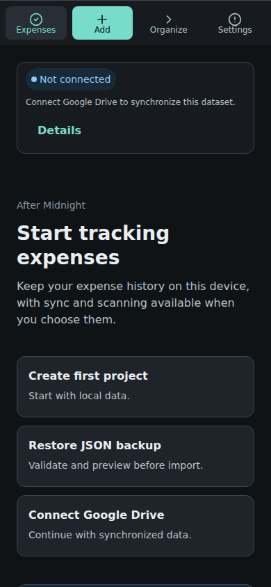

#### Code References
- [`src/design-system/components.tsx`](../src/design-system/components.tsx#L82-L91) (`AppFrame` component)
- [`src/design-system/tokens.css`](../src/design-system/tokens.css#L151-L160) (`.ds-app-frame`, `.ds-app-frame__main`)
- [`src/design-system/tokens.css`](../src/design-system/tokens.css#L851-L895) (`.ds-navigation`, `.ds-navigation__item`)
- [`src/features/local-ui.css`](../src/features/local-ui.css#L104-L125)

#### Root Cause Analysis
In `AppFrame`, `<aside className="ds-app-frame__navigation">{navigation}</aside>` is rendered before `<main className="ds-app-frame__main">{children}</main>` in the DOM. On screens below 720px, `.ds-app-frame` is ordinary block display with no flex ordering. Therefore, the navigation bar renders at the very top of the mobile screen above the header and content. This directly violates `DESIGN_SYSTEM.md` (lines 137, 145), which mandates compact screens use a bottom navigation bar with safe-area insets.

#### Remediation Plan for Coding Agent
1. Update `.ds-navigation` in `src/design-system/tokens.css`:
   ```css
   @media (max-width: 719px) {
     .ds-navigation {
       position: fixed;
       bottom: 0;
       left: 0;
       right: 0;
       z-index: 10;
       padding-bottom: max(var(--space-2), env(safe-area-inset-bottom));
       background: var(--color-surface-1);
       border-top: 1px solid var(--color-border-subtle);
       box-shadow: 0 -4px 16px rgb(0 0 0 / 28%);
     }

     .ds-app-frame__main {
       padding: var(--space-4);
       padding-bottom: calc(var(--control-height) + var(--space-6) + env(safe-area-inset-bottom));
     }
   }
   ```
2. In `src/design-system/tokens.css`, ensure `.ds-navigation__item` on mobile stacks the icon above the label with a compact 12px caption font and adequate touch target (`min-height: 48px`).

---

### Finding 2: SearchField Clear Button Absolute Positioning & Boundary Overflow

- **Severity:** High (Visual Regression & Component Defect)
- **Viewports:** All (Desktop & Mobile)
- **Evidence:**
  - `screenshots/04_desktop_input_clear_button_bug.png`
  - `screenshots/05_desktop_project_created_toast.png`
  - `screenshots/08_desktop_manual_expense_form_bottom.png`
  - `screenshots/13_desktop_expense_form_filled.png`
  - `screenshots/20_desktop_manage_categories.png`

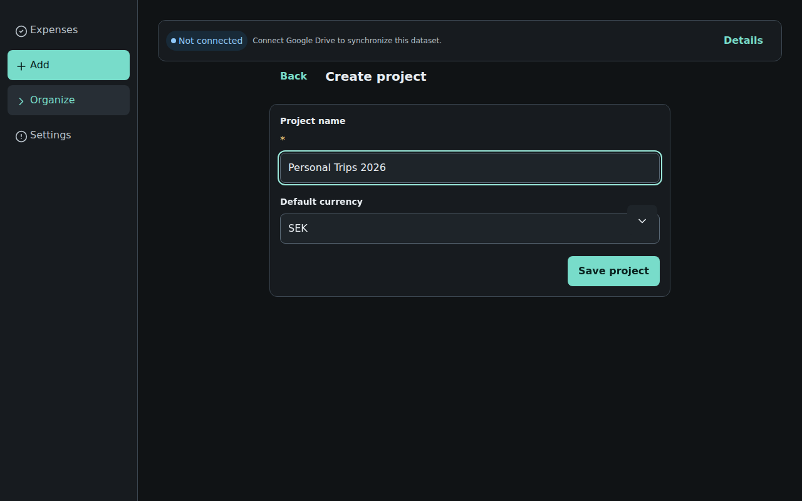
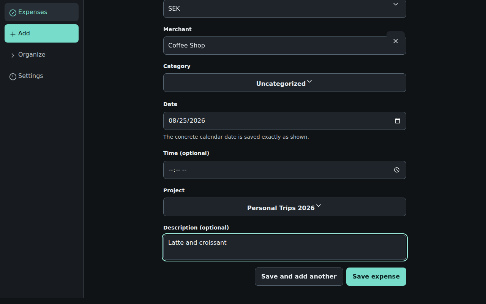

#### Code References
- [`src/design-system/components.tsx`](../src/design-system/components.tsx#L568-L598) (`SearchField` component)
- [`src/design-system/tokens.css`](../src/design-system/tokens.css#L475-L489) (`.ds-search-field`, `.ds-search-field__clear`)

#### Root Cause Analysis
`SearchField` renders:
```tsx
<AriaSearchField className="ds-field ds-search-field">
  <AriaLabel className="ds-field__label">{label}</AriaLabel>
  <AriaInput className="ds-field-control" placeholder={placeholder} />
  <AriaButton className="ds-icon-button ds-search-field__clear" ... />
</AriaSearchField>
```
Because `.ds-search-field` is a CSS grid with `display: grid; gap: var(--space-2)`, its total height includes the label, gap, and input. Applying `position: relative` to `.ds-search-field` causes `.ds-search-field__clear` with `top: 50%; transform: translateY(-50%)` to center itself against the *entire field container*, causing the button to float over the top border of the `<input>`. Furthermore, the clear button uses `.ds-icon-button` (a solid dark surface with border) and renders unconditionally even when the input is empty.

#### Remediation Plan for Coding Agent
1. In `src/design-system/components.tsx`, wrap the `<AriaInput>` and `<AriaButton>` inside a dedicated `.ds-field-control-wrap` container:
   ```tsx
   export function SearchField({ label, placeholder, description, className, onValueChange, ...props }: SearchFieldProps) {
     return (
       <AriaSearchField
         {...props}
         className={cx("ds-field", "ds-search-field", className)}
         onChange={onValueChange}
       >
         <AriaLabel className="ds-field__label">{label}</AriaLabel>
         <div className="ds-field-control-wrap">
           <AriaInput className="ds-field-control ds-search-field__input" placeholder={placeholder} />
           <AriaButton
             className="ds-search-field__clear"
             aria-label="Clear search"
             onPress={() => onValueChange?.("")}
           >
             <Icon><X size={16} /></Icon>
           </AriaButton>
         </div>
         {description ? <AriaText slot="description" className="ds-field__description">{description}</AriaText> : null}
       </AriaSearchField>
     );
   }
   ```
2. In `src/design-system/tokens.css`:
   ```css
   .ds-field-control-wrap {
     position: relative;
     display: flex;
     align-items: center;
     width: 100%;
   }

   .ds-search-field__input {
     padding-inline-end: var(--space-8);
   }

   .ds-search-field__clear {
     position: absolute;
     right: var(--space-2);
     top: 50%;
     transform: translateY(-50%);
     display: inline-flex;
     align-items: center;
     justify-content: center;
     width: 28px;
     height: 28px;
     padding: 0;
     border: 0;
     border-radius: var(--radius-pill);
     background: transparent;
     color: var(--color-text-secondary);
     cursor: pointer;
   }

   .ds-search-field__clear:hover {
     color: var(--color-text-primary);
     background: var(--color-surface-3);
   }

   /* Hide clear button when input is empty (React Aria data attribute or :empty) */
   .ds-search-field[data-empty] .ds-search-field__clear,
   .ds-search-field:not([data-has-value="true"]) .ds-search-field__clear {
     display: none;
   }
   ```

---

### Finding 3: Notification Toast Document Flow & Layout Shift (CLS) Defect

- **Severity:** High (Core UI Glitch & Layout Instability)
- **Viewports:** All
- **Evidence:**
  - `screenshots/14_desktop_toast_layout_bump_bug.png`
  - `screenshots/31_desktop_gallery_overview.png`
  - `screenshots/36_desktop_gallery_bottom_4.png`

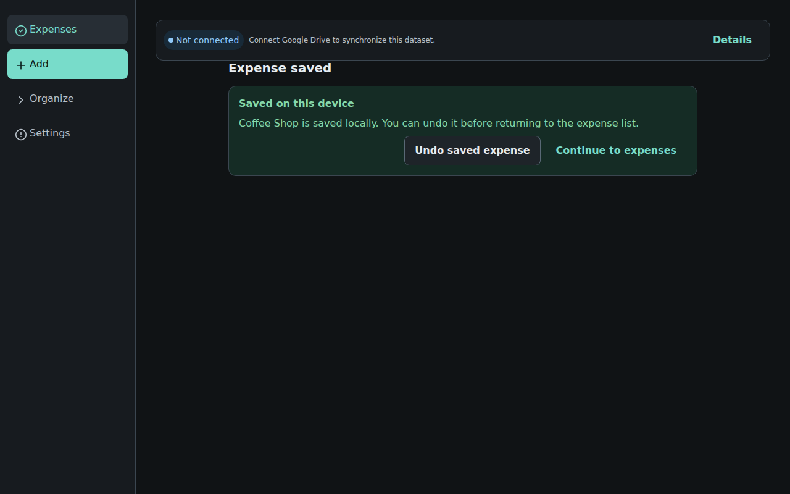

#### Code References
- [`src/features/local-ui.tsx`](../src/features/local-ui.tsx#L3214-L3223) (`local-ui-toast-wrap` in `LocalShellApp`)
- [`src/design-system/components.tsx`](../src/design-system/components.tsx#L1455-L1471) (`Toast` component)
- [`src/design-system/tokens.css`](../src/design-system/tokens.css#L787-L794) (`.ds-toast`)

#### Root Cause Analysis
In `src/features/local-ui.tsx`:
```tsx
{appNotice ? (
  <div className="local-ui-toast-wrap">
    <Toast>{appNotice}</Toast>
    <Button variant="quiet" onPress={() => setAppNotice(null)}>
      Dismiss
    </Button>
  </div>
) : null}
```
1. `.local-ui-toast-wrap` has no CSS position and is rendered inside the regular DOM hierarchy of `<main>`.
2. `.ds-toast` is styled with `position: fixed; right: var(--space-4); bottom: var(--space-4);`.
3. However, the `<Button variant="quiet">Dismiss</Button>` remains in the normal document flow. Whenever a toast is triggered (e.g. saving an expense, updating a project), a 48px+ block element pops into existence at the bottom of the page, pushing existing content and causing jarring Cumulative Layout Shift (CLS).
4. Furthermore, the Dismiss button is rendered hundreds of pixels away from the floating notification itself!

#### Remediation Plan for Coding Agent
1. Colocate the Dismiss button inside the `Toast` component or provide an integrated `onDismiss` callback in `ToastProps`.
2. In `src/design-system/components.tsx`:
   ```tsx
   export type ToastProps = {
     children: ReactNode;
     tone?: Tone;
     onDismiss?: () => void;
     className?: string;
   };

   export function Toast({ children, tone = "positive", onDismiss, className }: ToastProps) {
     return (
       <div
         className={cx("ds-toast", "ds-status-message", className)}
         data-tone={tone}
         role="status"
         aria-live="polite"
       >
         <div className="ds-toast__content">{children}</div>
         {onDismiss ? (
           <button
             type="button"
             className="ds-toast__dismiss"
             aria-label="Dismiss notification"
             onClick={onDismiss}
           >
             <X size={16} />
           </button>
         ) : null}
       </div>
     );
   }
   ```
3. Update `src/features/local-ui.tsx` to render `<Toast onDismiss={() => setAppNotice(null)}>{appNotice}</Toast>` without the stray external `Button`.
4. Style `.ds-toast` with flexbox layout:
   ```css
   .ds-toast {
     position: fixed;
     z-index: 30;
     right: var(--space-4);
     bottom: max(var(--space-4), calc(var(--control-height) + var(--space-4)));
     display: inline-flex;
     align-items: center;
     gap: var(--space-3);
     max-width: min(90vw, 420px);
     box-shadow: var(--shadow-overlay);
   }
   ```

---

### Finding 4: Required Field Asterisk Rendered on Separate Line as Grid Row

- **Severity:** Medium (Form Visual Polish & Typography)
- **Viewports:** All
- **Evidence:**
  - `screenshots/03_desktop_create_project_modal.png`
  - `screenshots/07_desktop_manual_expense_form.png`
  - `screenshots/10_mobile_manual_expense_form_top.png`
  - `screenshots/21_desktop_create_category_form.png`

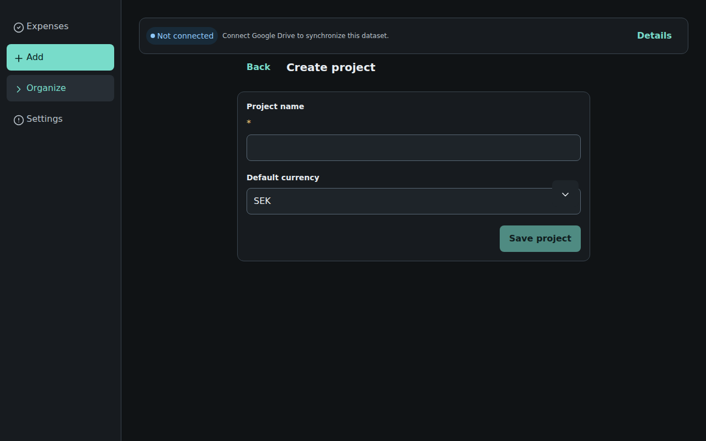
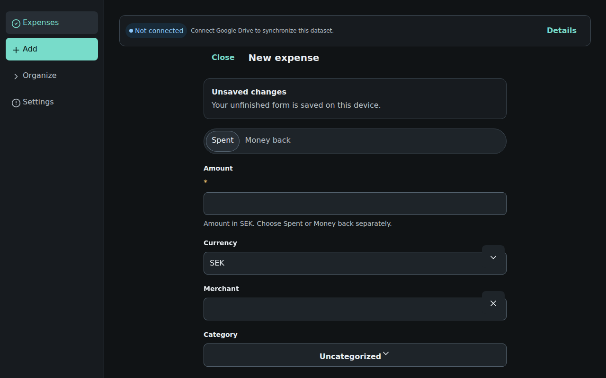

#### Code References
- [`src/design-system/components.tsx`](../src/design-system/components.tsx#L487-L496) (`TextField`)
- [`src/design-system/components.tsx`](../src/design-system/components.tsx#L445-L460) (`Field`)

#### Root Cause Analysis
In `TextField` and other form primitives, the required asterisk is rendered as a standalone sibling to `<AriaLabel>`:
```tsx
<AriaTextField className="ds-field ...">
  <AriaLabel className="ds-field__label">{label}</AriaLabel>
  {props.isRequired ? <span className="ds-field__required">*</span> : null}
  <AriaInput className="ds-field-control" ... />
  ...
</AriaTextField>
```
Because `.ds-field` is styled as `display: grid; gap: var(--space-2)`, every direct child becomes a grid row. Consequently, `<span className="ds-field__required">*</span>` occupies its own row between the label and the input box, looking like an isolated floating asterisk.

#### Remediation Plan for Coding Agent
Move the required asterisk inside the `<AriaLabel>` element across all form components:
```tsx
<AriaLabel className="ds-field__label">
  {label}
  {props.isRequired ? <span className="ds-field__required" aria-hidden="true"> *</span> : null}
</AriaLabel>
```

---

### Finding 5: CSS Grid Stretches SegmentedControl & ActionCards into Massive Distorted Ovals

- **Severity:** High (Major Visual Regression in Grid Containers)
- **Viewports:** Desktop & Multi-Column Layouts (`>= 720px`)
- **Evidence:**
  - `screenshots/31_desktop_gallery_overview.png`
  - `screenshots/32_desktop_gallery_middle.png`
  - `screenshots/33_desktop_gallery_bottom.png`

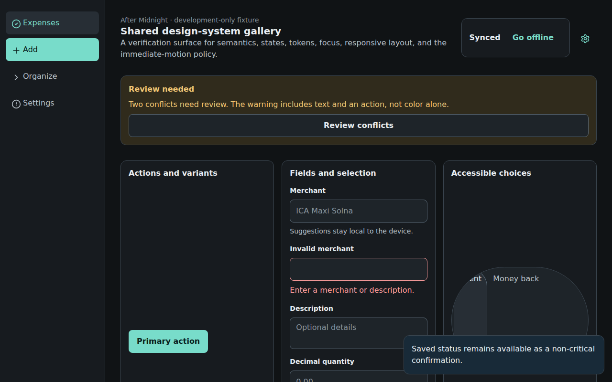
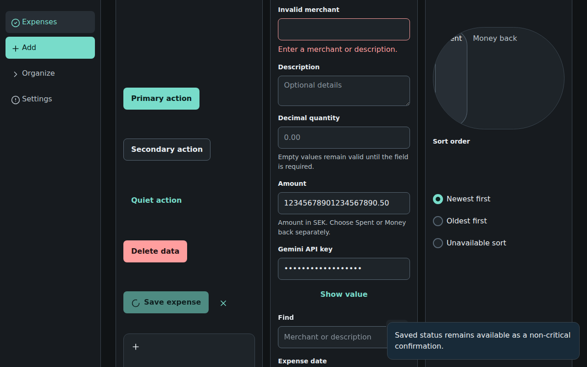

#### Code References
- [`src/design-system/tokens.css`](../src/design-system/tokens.css#L220-L223) (`.ds-responsive-grid`)
- [`src/design-system/tokens.css`](../src/design-system/tokens.css#L546-L570) (`.ds-segmented-control`)
- [`src/design-system/tokens.css`](../src/design-system/tokens.css#L400-L424) (`.ds-action-card`)
- [`src/design-system/tokens.css`](../src/design-system/tokens.css#L944-L960) (`.ds-gallery__section`)

#### Root Cause Analysis
In CSS Grid, when columns have unequal content (e.g. Column 2 has 12 fields while Column 3 has only 3 components), the default `align-items: stretch` causes grid children in shorter columns to expand vertically to fill the cell height.
`.ds-segmented-control` has `display: inline-flex` with `border-radius: var(--radius-pill)` (`999px`). When stretched vertically to 223px tall by CSS Grid, the pill border-radius turns the control into an enormous 287×223px circle/oval. Similarly, `ActionCard`s stretch to hundreds of pixels in height with vast empty space.

#### Remediation Plan for Coding Agent
1. In `src/design-system/tokens.css`, add `align-content: start; align-items: start;` to `.ds-responsive-grid` and section cards:
   ```css
   .ds-responsive-grid {
     display: grid;
     grid-template-columns: minmax(0, 1fr);
     align-items: start;
     align-content: start;
   }

   .ds-gallery__section {
     display: grid;
     gap: var(--space-4);
     align-content: start;
     align-items: start;
     padding: var(--space-4);
     border: 1px solid var(--color-border-subtle);
     border-radius: var(--radius-card);
     background: var(--color-surface-1);
   }
   ```
2. Restrict `.ds-segmented-control` to its intended height:
   ```css
   .ds-segmented-control {
     display: inline-flex;
     align-self: start;
     min-height: var(--target-min);
     height: var(--control-height);
     max-width: 100%;
     overflow-x: auto;
     padding: var(--space-1);
     border: 1px solid var(--color-border-subtle);
     border-radius: var(--radius-pill);
     background: var(--color-surface-2);
   }
   ```
3. For full-width form segmented controls (such as "Spent / Money back" in `ExpenseForm`), provide a `fullWidth` variant that divides segments equally:
   ```css
   .ds-segmented-control[data-full-width="true"] {
     display: flex;
     width: 100%;
   }

   .ds-segmented-control[data-full-width="true"] > * {
     flex: 1 1 0;
     text-align: center;
     justify-content: center;
   }
   ```

---

### Finding 6: Money Amounts Wrapping Vertically Character-by-Character

- **Severity:** High (Visual Defect & Financial Readability)
- **Viewports:** All
- **Evidence:**
  - `screenshots/36_desktop_gallery_bottom_4.png`

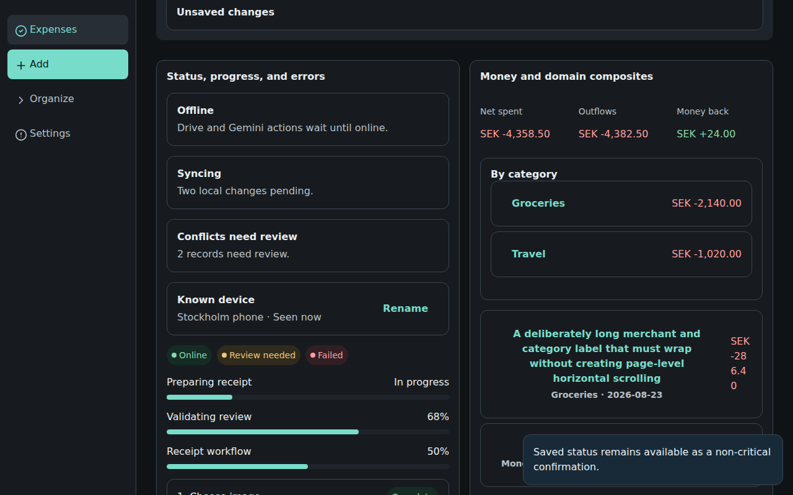

#### Code References
- [`src/design-system/tokens.css`](../src/design-system/tokens.css#L263-L276) (`.ds-money`)
- [`src/design-system/tokens.css`](../src/design-system/tokens.css#L665-L683) (`.ds-list-row`)
- [`src/design-system/components.tsx`](../src/design-system/components.tsx#L1060-L1090) (`ListRow`)

#### Root Cause Analysis
In `src/design-system/tokens.css` line 265:
```css
.ds-money {
  font-variant-numeric: tabular-nums;
  overflow-wrap: anywhere;
  white-space: normal;
}
```
When an expense row has a long title (e.g. "A deliberately long merchant and category label..."), the flex layout crushes the right-hand money container. Because `.ds-money` permits `overflow-wrap: anywhere; white-space: normal`, the text engine wraps `SEK -286.40` across 4 vertical lines ("SEK", "-28", "6.4", "0").

#### Remediation Plan for Coding Agent
1. In `src/design-system/tokens.css`, enforce non-wrapping tabular numbers on money amounts:
   ```css
   .ds-money {
     font-variant-numeric: tabular-nums;
     white-space: nowrap;
     flex-shrink: 0;
   }
   ```
2. In `.ds-list-row`:
   ```css
   .ds-list-row {
     display: flex;
     min-width: 0;
     min-height: var(--control-height);
     align-items: center;
     justify-content: space-between;
     gap: var(--space-3);
     padding: var(--space-3) var(--space-4);
   }

   .ds-list-row__main {
     flex: 1 1 auto;
     min-width: 0;
   }

   .ds-list-row__trailing {
     flex: 0 0 auto;
     white-space: nowrap;
   }
   ```

---

### Finding 7: Inconsistent Baseline and Label Alignment in FilterBar

- **Severity:** Medium (Visual Hierarchy & Alignment)
- **Viewports:** Desktop & Tablet
- **Evidence:**
  - `screenshots/05_desktop_project_created_toast.png`
  - `screenshots/15_desktop_expenses_list_with_item.png`
  - `screenshots/34_desktop_gallery_bottom_2.png`

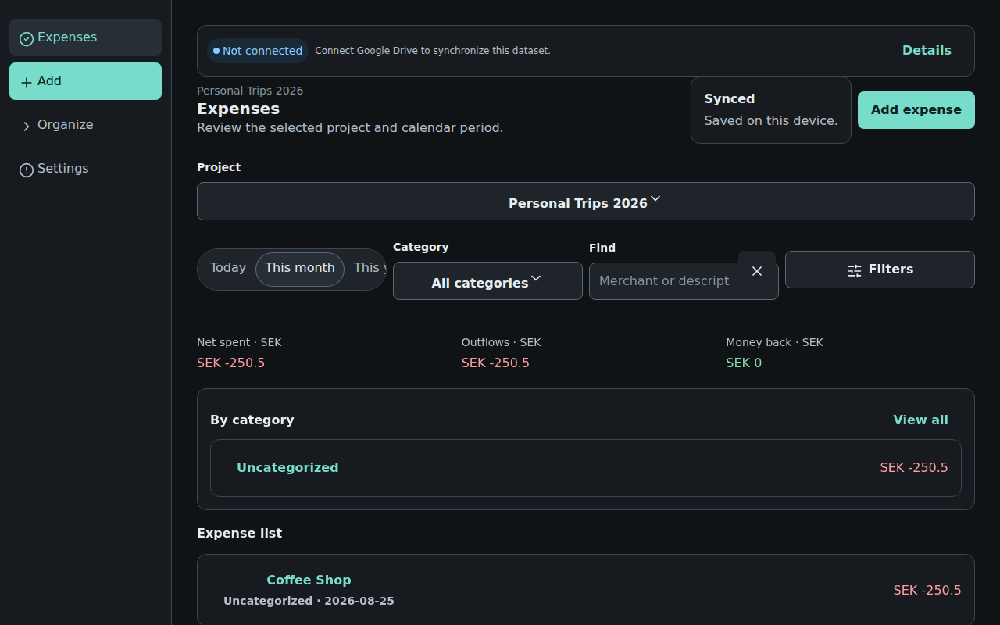

#### Code References
- [`src/features/local-ui.tsx`](../src/features/local-ui.tsx#L690-L725) (`ExpensesScreen` filter bar)
- [`src/design-system/tokens.css`](../src/design-system/tokens.css#L896-L903) (`.ds-filter-bar`)
- [`src/features/local-ui.css`](../src/features/local-ui.css#L67-L79) (`.local-ui-expenses-filter-bar`)

#### Root Cause Analysis
In the Expenses screen filter bar:
- `PeriodPicker` renders a `SegmentedControl` without a top label.
- `CategoryPicker` and `SearchField` render a full `Field` with a top label (`Category`, `Find`).
- `Filters` button renders a standalone `Button` without a top label.
Because flex row aligns items by center or stretch, the top labels push the dropdown and text input downwards relative to the PeriodPicker and Filters button, creating an uneven, broken baseline across the row.

#### Remediation Plan for Coding Agent
1. Align all interactive control boxes to a common baseline using `align-items: flex-end`:
   ```css
   .ds-filter-bar,
   .local-ui-expenses-filter-bar {
     display: flex;
     flex-wrap: wrap;
     gap: var(--space-3);
     align-items: flex-end;
   }
   ```
2. Ensure standalone buttons in the filter bar match the height (`var(--control-height)`) of the adjacent field inputs.
3. On compact mobile viewports, allow the filter bar to flow cleanly without clipping segmented buttons:
   ```css
   @media (max-width: 719px) {
     .local-ui-expenses-filter-bar {
       display: grid;
       grid-template-columns: 1fr;
       gap: var(--space-2);
     }
   }
   ```

---

### Finding 8: Premature Unsaved Changes Banner on Pristine Forms

- **Severity:** Low to Medium (UX & Form Noise)
- **Viewports:** All
- **Evidence:**
  - `screenshots/07_desktop_manual_expense_form.png`
  - `screenshots/10_mobile_manual_expense_form_top.png`


#### Code References
- [`src/features/local-ui.tsx`](../src/features/local-ui.tsx#L1910-L1935) (`ManualExpenseFormScreen`)
- [`src/design-system/components.tsx`](../src/design-system/components.tsx#L1910-L1925) (`DraftStatus`)

#### Root Cause Analysis
When opening `/expense/new`, the `DraftStatus` component immediately renders:
```tsx
<Card>
  <strong>Unsaved changes</strong>
  <p>Your unfinished form is saved on this device.</p>
</Card>
```
This is shown on clean, unedited forms where the user hasn't typed anything yet, creating visual clutter and falsely implying that previous data is lingering.

#### Remediation Plan for Coding Agent
1. Only display `DraftStatus` when `actor.getSnapshot().context.isDirty` is `true` or when restored draft data differs from default initial state.
2. When clean, either omit the banner or present it as a subtle status dot in the header.

---

### Finding 9: Smashed PageHeader Back / Close Navigation Links

- **Severity:** Medium (Accessibility & Visual Design)
- **Viewports:** All
- **Evidence:**
  - `screenshots/03_desktop_create_project_modal.png`
  - `screenshots/07_desktop_manual_expense_form.png`
  - `screenshots/19_desktop_manage_projects.png`
  - `screenshots/21_desktop_create_category_form.png`
  - `screenshots/23_desktop_settings_drive_sync.png`
  - `screenshots/29_desktop_receipt_scan.png`

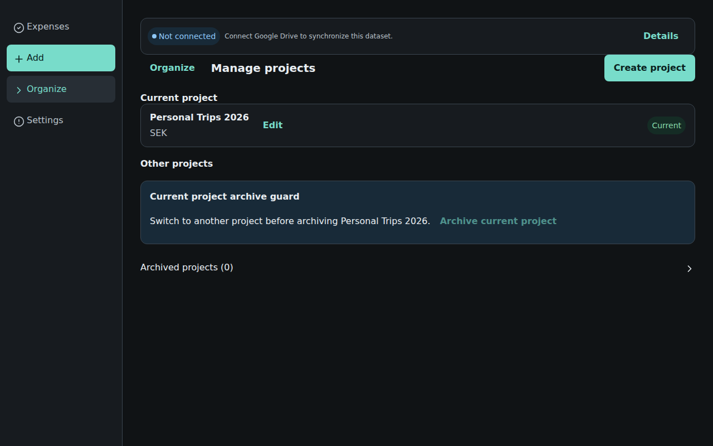
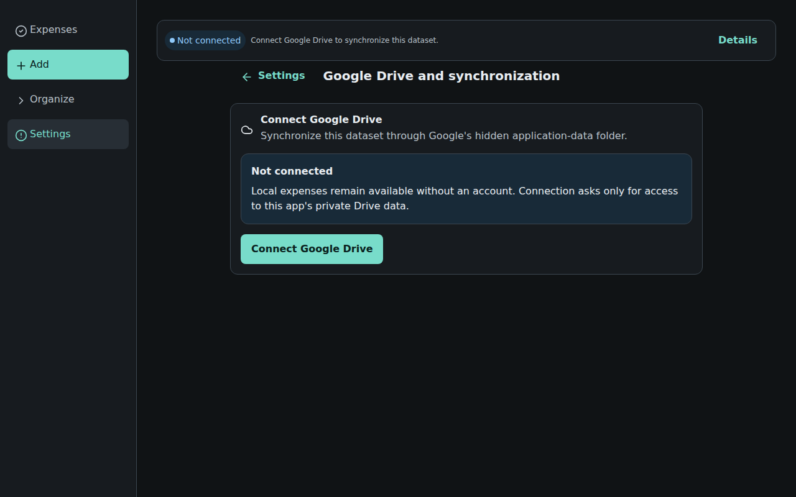

#### Code References
- [`src/design-system/components.tsx`](../src/design-system/components.tsx#L104-L130) (`PageHeader`)
- [`src/features/local-ui.tsx`](../src/features/local-ui.tsx)

#### Root Cause Analysis
In `PageHeader`, `leading` is passed as a plain text button:
```tsx
<Button variant="quiet" onPress={...}>Back</Button>
```
Inside `.ds-page-header__title`:
```css
.ds-page-header__title {
  display: flex;
  min-width: 0;
  flex: 1 1 240px;
  align-items: center;
  gap: var(--space-3);
}
```
Because the button has no icon, zero padding, and quiet variant text, it renders as a teal word (`Back`, `Close`, `Settings`) crammed directly next to the `<h1>` title, looking like a typo or broken text concatenation.

#### Remediation Plan for Coding Agent
1. In `src/design-system/components.tsx`, update `PageHeader` leading navigation actions to use an `IconButton` with an icon (e.g. `<ArrowLeft size={20} />` for back, `<X size={20} />` for close) and an accessible label.
2. Add distinct visual separation and minimum 44px hit targets.

---

### Finding 10: SecretField Reveal Toggle Centered Below Field

- **Severity:** Medium (Form Component Ergonomics)
- **Viewports:** All
- **Evidence:**
  - `screenshots/24_desktop_settings_gemini.png`
  - `screenshots/32_desktop_gallery_middle.png`

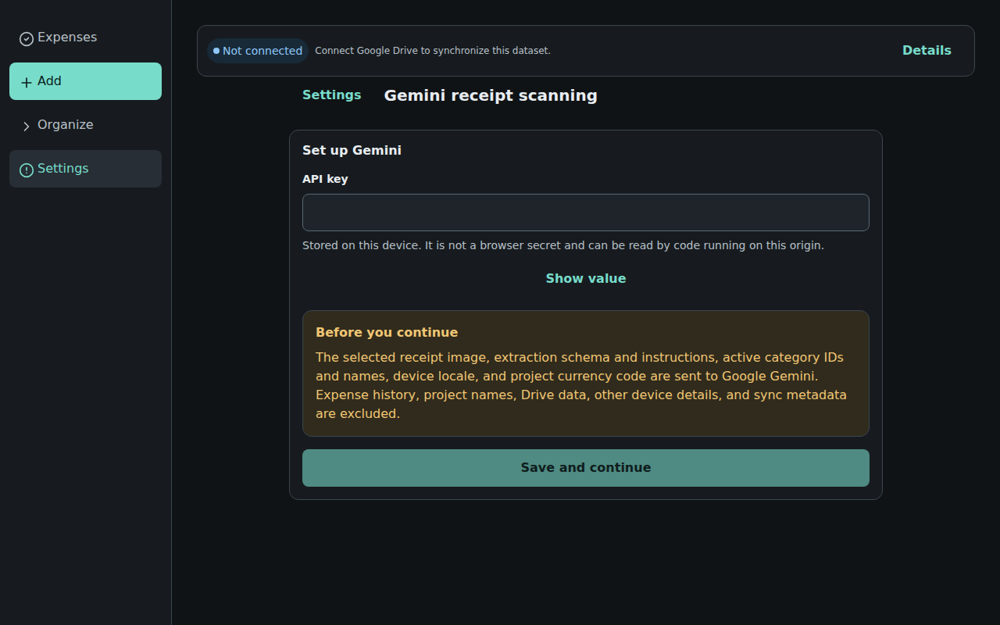

#### Code References
- [`src/design-system/components.tsx`](../src/design-system/components.tsx#L604-L620) (`SecretField`)

#### Root Cause Analysis
`SecretField` is structured as:
```tsx
export function SecretField({ revealLabel = "Show value", ...props }: SecretFieldProps) {
  const [revealed, setRevealed] = useState(false);
  return (
    <div className="ds-field">
      <TextField {...props} type={revealed ? "text" : "password"} />
      <Button
        type="button"
        variant="quiet"
        onPress={() => setRevealed((current) => !current)}
      >
        {revealed ? "Hide" : revealLabel}
      </Button>
    </div>
  );
}
```
Because `Button` is placed outside `TextField` as a sibling in `.ds-field` (which is a grid), the button becomes its own full row underneath the input, floating in the center of the card.

#### Remediation Plan for Coding Agent
Refactor `SecretField` to place the reveal toggle as an absolute trailing adornment inside the input wrapper:
```tsx
export function SecretField({ revealLabel = "Show value", ...props }: SecretFieldProps) {
  const [revealed, setRevealed] = useState(false);
  return (
    <TextField
      {...props}
      type={revealed ? "text" : "password"}
      trailingAction={
        <Button
          type="button"
          variant="quiet"
          className="ds-secret-field__toggle"
          onPress={() => setRevealed((current) => !current)}
          aria-label={revealed ? "Hide value" : revealLabel}
        >
          {revealed ? <EyeOff size={18} /> : <Eye size={18} />}
        </Button>
      }
    />
  );
}
```

---

### Finding 11: ColorChoiceField Swatches Alignment & Custom Input Clunkiness

- **Severity:** Low to Medium
- **Viewports:** All
- **Evidence:**
  - `screenshots/21_desktop_create_category_form.png`
  - `screenshots/33_desktop_gallery_bottom.png`

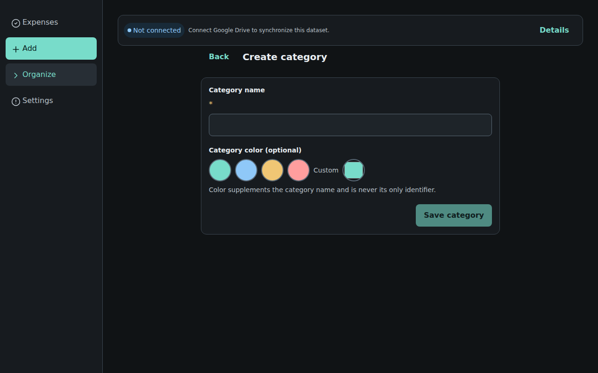

#### Code References
- [`src/design-system/components.tsx`](../src/design-system/components.tsx#L826-L874) (`ColorChoiceField`)
- [`src/design-system/tokens.css`](../src/design-system/tokens.css#L195-L218) (`.ds-color-choice__custom`)

#### Root Cause Analysis
- Preset swatch buttons have inline style `width: var(--control-height); height: var(--control-height);` (48px circles), which look overly large.
- The custom color picker `<label className="ds-color-choice__custom">` wraps text `Custom` and `<input type="color">` with uneven gaps and misaligned vertical baselines.

#### Remediation Plan for Coding Agent
1. Size color swatches uniformly at `36px × 36px` with `border-radius: 50%`.
2. Align preset swatches and custom picker neatly in an `Inline` container with `gap: var(--space-2); align-items: center;`.
3. Provide consistent visible focus rings (`--focus-ring-width: 2px`).

---

### Finding 12: Decimal Precision & Currency Formatting Inconsistency

- **Severity:** Low (Polish / Formatting)
- **Viewports:** All
- **Evidence:**
  - `screenshots/05_desktop_project_created_toast.png`
  - `screenshots/15_desktop_expenses_list_with_item.png`


#### Code References
- [`src/domain/money/format.ts`](../src/domain/money) / [`MoneyText`](../src/design-system/components.tsx)

#### Root Cause Analysis
Formatted money strings are displaying `-250.5` instead of `-250.50`. ISO currency display for decimals should format to 2 decimal places consistently when fractional currency is used.

#### Remediation Plan for Coding Agent
Ensure the money formatting utility pads fractional amounts to the required 2 decimal places (e.g. `250.5` → `250.50`).

---

### Finding 13: DangerDialog Missing Explicit Cancel Action Button

- **Severity:** Low to Medium (Accessibility & Safety Confirmation)
- **Viewports:** All
- **Evidence:**
  - `screenshots/39_desktop_danger_dialog.png`

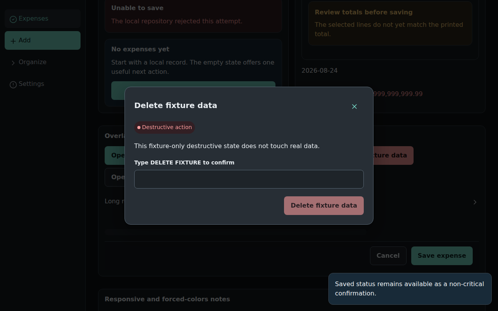

#### Code References
- [`src/design-system/components.tsx`](../src/design-system/components.tsx#L1301-L1336) (`DangerDialog`)

#### Root Cause Analysis
`DangerDialog` renders only the destructive action button (`Delete fixture data`) in the dialog footer. There is no explicit `Cancel` button next to it; users must click the top-right `X` or press `Escape`. Accessible dialog standards require a paired secondary "Cancel" button in the footer for clear safety control.

#### Remediation Plan for Coding Agent
In `DangerDialog`:
```tsx
<Inline justify="end" gap={3}>
  <Button variant="secondary" onPress={close}>
    Cancel
  </Button>
  <Button
    variant="danger"
    isDisabled={requiresPhrase && typed !== phrase}
    onPress={onConfirm}
  >
    {confirmLabel}
  </Button>
</Inline>
```

---

### Finding 14: Flexbox & Grid Sizing Abuse (Unnatural Element Widths & Crushed Controls)

- **Severity:** High (Core UI Ergonomics & Responsive Structure)
- **Viewports:** All
- **Evidence:**
  - `screenshots/07_desktop_manual_expense_form.png` (Spent / Money back void)
  - `screenshots/18_desktop_organize_view.png` (Organize row widths)
  - `screenshots/33_desktop_gallery_bottom.png` (Stretched ActionCards)
  - `screenshots/36_desktop_gallery_bottom_4.png` (Crushed trailing cells)

#### Code References
- [`src/design-system/tokens.css`](../src/design-system/tokens.css)
- [`src/features/local-ui.css`](../src/features/local-ui.css)

#### Root Cause Analysis
Throughout the interface, flexbox and grid properties are applied indiscriminately without setting appropriate constraints (`flex: 1` vs `flex: 0 0 auto`, missing `min-width: 0`, and missing `align-items: start`). This causes:
1. Small compact controls (Date pickers, Time inputs, Currency selectors) to stretch to 100% full container width (640px) on desktop when they should naturally be compact or paired side-by-side.
2. Segmented controls in forms to span 100% width with only one small pill on the left and a large empty void on the right.
3. Asymmetrical multi-column grids in cards and galleries to stretch shorter columns into gigantic empty boxes.

#### Remediation Plan for Coding Agent
1. Enforce natural widths for compact controls (`Button`, `SelectField`, `SegmentedControl`, `ColorChoiceField`, `NativeDateField`, `NativeTimeField`, `Badge`, `Chip`).
2. Provide a `fullWidth` prop/variant for `SegmentedControl` that splits segments evenly (`flex: 1 1 0` per segment).
3. Ensure all multi-column grid containers (`ResponsiveGrid`, `.ds-gallery__section`) have `align-content: start; align-items: start;`.
4. Ensure trailing metadata and monetary metrics in flex rows always have `flex-shrink: 0; white-space: nowrap;`.

---

### Finding 15: Missing Element Breathing Room & Spacing Rhythm Violations

- **Severity:** Medium (Visual Polish & Visual Rhythm)
- **Viewports:** All
- **Evidence:**
  - `screenshots/03_desktop_create_project_modal.png`
  - `screenshots/12_mobile_manual_expense_form_save_buttons.png`
  - `screenshots/19_desktop_manage_projects.png`
  - `screenshots/30_desktop_receipt_scan_source_picker.png`

#### Code References
- [`src/design-system/tokens.css`](../src/design-system/tokens.css#L88-L98) (`--space-1` through `--space-10`)
- [`src/features/local-ui.tsx`](../src/features/local-ui.tsx)

#### Root Cause Analysis
Several views fail to apply the 4px token spacing system consistently:
- Buttons in action areas touch or float unevenly with zero margin/gap from container edges.
- Text labels in `PageHeader` leading slots are crammed against headings with no visual boundary.
- Take photo / Choose image buttons in `ReceiptSourcePicker` float directly against notices without standard card padding.

#### Remediation Plan for Coding Agent
1. Apply standard spacing scale across all component compositions:
   - `--space-1` (4px): Micro-spacing (badges, compact pill padding)
   - `--space-2` (8px): Intra-field elements, inline chips, tight button pairs
   - `--space-3` (12px): List row padding, filter bar gaps
   - `--space-4` (16px): Card internal padding, section element stacking
   - `--space-5` (20px) / `--space-6` (24px): Distinct card stacks, dialog content padding
   - `--space-7` (32px) / `--space-8` (40px): Page gutters and main landmark margins
2. Enforce that every interactive element has at least `--space-2` (8px) breathing room from neighboring elements.

---

## 4. Prioritized Action Plan for Implementation Agent

This table orders the remediation tasks by dependency and impact so a future coding agent can implement them sequentially:

| Priority | Task ID | Description | Affected Files | Expected Verification |
|---|---|---|---|---|
| **P0** | `FIX-01` | **Fix Mobile Navigation Position:** Move bottom bar to `position: fixed; bottom: 0;` on mobile with safe-area insets. | `src/design-system/tokens.css`, `src/design-system/components.tsx` | Viewport `390×844` shows bottom tabs; content not obscured. |
| **P0** | `FIX-02` | **Fix SearchField Clear Button:** Wrap input and button in control group; fix positioning; hide when empty. | `src/design-system/components.tsx`, `src/design-system/tokens.css` | Clear button stays vertically centered inside input control; no overflow. |
| **P0** | `FIX-03` | **Fix Toast Layout Shift & Colocate Dismiss:** Remove in-flow toast wrapper; fix to bottom-right viewport overlay. | `src/features/local-ui.tsx`, `src/design-system/components.tsx`, `src/design-system/tokens.css` | Toast triggers without shifting DOM content; Dismiss button inside pill. |
| **P1** | `FIX-04` | **Fix Required Asterisk Placement:** Move asterisk inside `AriaLabel` across all form fields. | `src/design-system/components.tsx` | Asterisk renders inline next to label text on same line. |
| **P1** | `FIX-05` | **Fix CSS Grid Stretch on SegmentedControl & Cards:** Add `align-items: start;` to `ResponsiveGrid`; constrain SegmentedControl height. | `src/design-system/tokens.css` | Gallery displays compact pills, not 220px ovals. |
| **P1** | `FIX-06` | **Fix Money Text Vertical Wrapping:** Set `white-space: nowrap; flex-shrink: 0;` on `.ds-money` and trailing list cells. | `src/design-system/tokens.css` | `SEK -286.40` never wraps character-by-character. |
| **P1** | `FIX-07` | **Fix FilterBar Baseline Alignment:** Apply `align-items: flex-end;` and uniform heights across filter controls. | `src/design-system/tokens.css`, `src/features/local-ui.css` | Period picker, dropdowns, search, and filters button share a clean baseline. |
| **P1** | `FIX-08` | **Enforce Layout & Flexbox Sizing Discipline:** Prevent arbitrary `width: 100%` on compact inputs; equalize form segmented controls. | `src/design-system/tokens.css`, `src/features/local-ui.css` | Compact inputs keep natural width; segmented controls distribute evenly. |
| **P2** | `FIX-09` | **Polish PageHeader Back/Close Actions:** Replace plain text leading buttons with clean icon buttons (`ArrowLeft`, `X`). | `src/design-system/components.tsx`, `src/features/local-ui.tsx` | Back triggers are well-proportioned icon buttons. |
| **P2** | `FIX-10` | **Refactor SecretField Reveal Toggle:** Move "Show value" toggle inline inside password input trailing slot. | `src/design-system/components.tsx`, `src/design-system/tokens.css` | Toggle sits inside field as trailing icon/button. |
| **P2** | `FIX-11` | **Hide Premature Unsaved Changes Banner:** Only show `DraftStatus` when form is dirty or restored. | `src/features/local-ui.tsx` | Fresh "New expense" form is clean and uncluttered. |
| **P2** | `FIX-12` | **Harmonize ColorChoiceField & Spacing Gaps:** Standardize 36px swatches, add Cancel to `DangerDialog`, apply 4px gap tokens. | `src/design-system/components.tsx`, `src/design-system/tokens.css` | Consistent breathing room and complete dialog action pairs. |
| **P3** | `FIX-13` | **Format Currency Decimal Precision:** Ensure two-digit decimal formatting (`SEK -250.50`). | `src/domain/money/` | All currency values display consistent 2-decimal precision. |

---

## 5. Supporting Guidelines & Skills

To assist coding agents in building and maintaining high-quality UI:
- **Design System Specification:** [`DESIGN_SYSTEM.md`](../DESIGN_SYSTEM.md) has been updated with explicit rules on layout, flexbox discipline, and spacing rhythm.
- **Repository Skill:** [`.agents/skills/ui-ux-design-system/SKILL.md`](../.agents/skills/ui-ux-design-system/SKILL.md) provides an on-demand guide with top antipatterns and pre-flight visual review checklists.

---

## 6. Verification Commands

Before and after completing fixes, the implementing agent must execute:
```bash
deno task fmt:check
deno task lint
deno task check
deno task test
deno task test:component
deno task test:e2e --grep local
deno task a11y:gallery
deno task build
```
And verify in `agent-browser` with both desktop (`1280×800`) and mobile (`390×844`) viewport captures.
